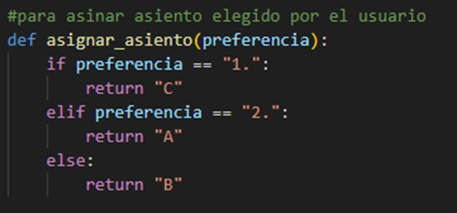
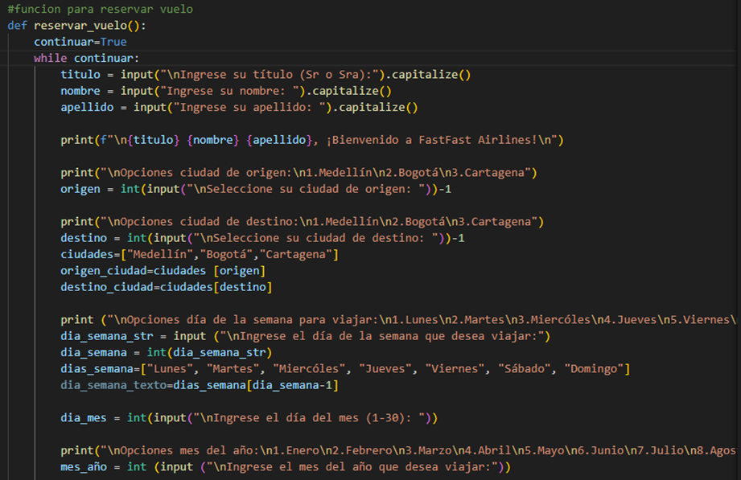
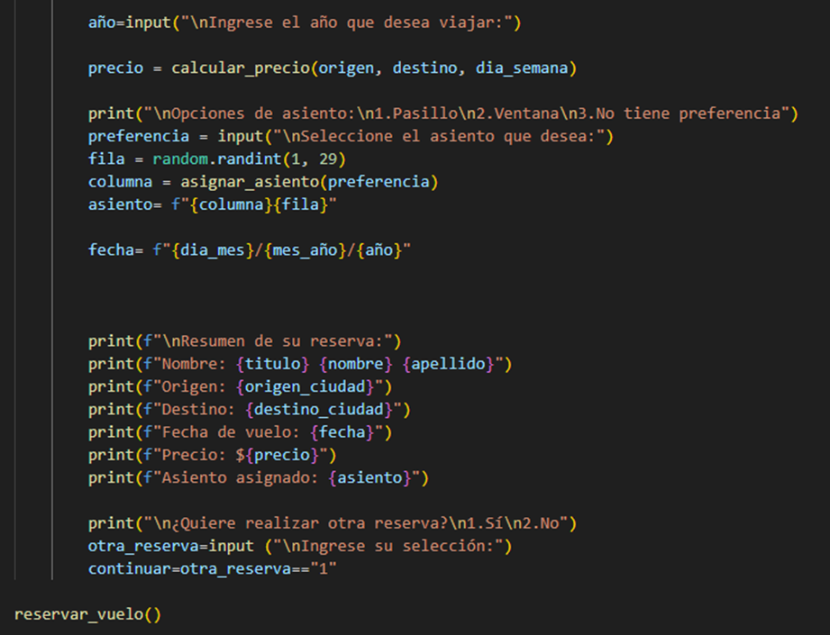

# Sistema de reservas de una aerolínea

Se desarrolló un código con el fin de simular el sistema de reservas de una aerolínea. 

### A continuación, se explicará lo que se realizó en la primera parte del código

1. Se utiliza import random para importar objetos de un modulo, en este caso para que seleccione aleatoriamente un asiento en el avión.

2. Con Distancias ={} se creó un diccionario para almacenar las distancias entre ciudades y de esta manera se le facilita al programa acceder a estas distancias mas fácilmente al momento de usarla en el cálculo del valor del tiquete.

3. Se utilizó un función con el fin de que realice una tarea especifica en este caso que calcule el precio según el día de la semana que el usuario desea viajar para esto se usó def calcular_precio(origen, destino, día_semana), luego se definió la condición, por ejemplo se definicio que si distancia<400 y el usuario viajaba de lunes a jueves el tiquete valía 79900, y luego se puso else para indicar que si no viajaba uno de esos días el tiquete tenia otro precio. 

### Para la segunda parte del código 

1. Se definió una función para asignar el asiento con def asignar_asiento(preferencia) y luego se puso condicionales de acuerdo a la opcion que ingresara el usuario 

### Ahora para la parte 3, se realizó lo siguiente: 
1.	Se definió una función para definir el proceso a realizar en la reserva del vuelo esta se definió como: def reservar_vuelo()

2.	Se creó un bucle para que realizara una serie de actividades 

3.	Por ejemplo en origen= int(("intput”))-1, se utilizó int para que el programa entienda que el valor que debe recibir del usuario es un numero entero y al final se agregó el -1 para que la opcion elegida por el usuario coincida con las opciones definidas en el directorio, entonces si el usuario ingresa que su origen es el destino 1 el programa le resta 1 por lo que da 0 lo que le indica al programa que el usuario tiene como destino la ciudad que se encuentra en la posición 0. 

4.	Con destino=… se realizó exactamente los mismo que con origen.

5.	Luego se definen las ciudades para que el programa sepa que imprimir cuando se menciona las ciudades y entienda a que se refiere cada numero del directorio.

6. Se definió como el programa debe procesar el día de la semana, el mes y el mes del año que desea viajar.

### Finalmente, en la parte 4: 

 1. Se definió como el programa debe procesar el año.

 2. Además se definió que función debe utilizar el programa para calcular el precio, para esto se usó precio= calcular_precio(origen, destino, dia_semana)

 3. Se usó el módulo importado en fila=random.randit (1,29) para que genere un valor en ese rango aleatoriamente y luego columna=f"{columna}{fila}" para que imprima la columna y la fila en la que queda asignado el asiento del usuario.

 4. Con fecha= ... para que en la interfaz le muestra claramente al usuario el día, el mes y el año en el que se está realizando la reserva.

 5. Se ingresan varios print con el fin de mostrarle al usuario el resumen de la reserva y que se visualice de manera más amena para este.

 6. Se le da la opción al usuario de realizar otra reserva o de si no desea realizar más reservas.
 7. Finalmente, se cierra la función reservar_vuelo con return reservar_vuelo () y esto lo que hace es retornarle al usuario el resultado de la función. 