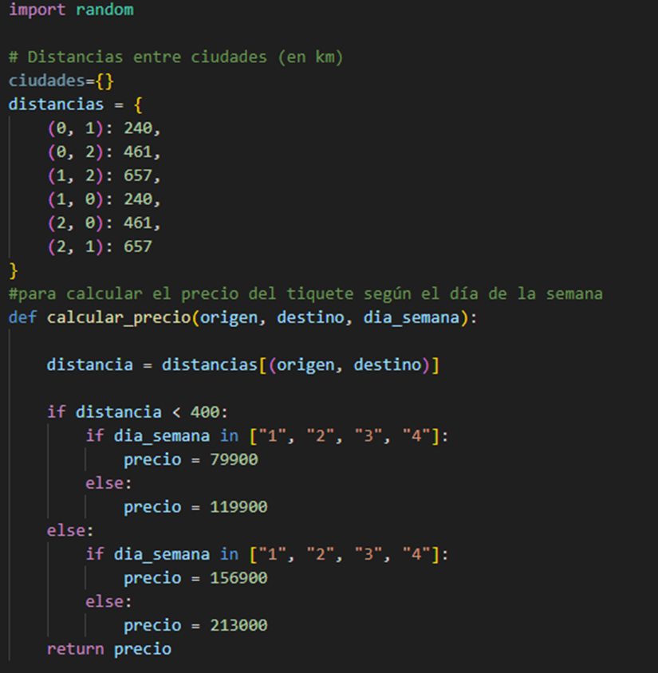

# Sistema de reservas de una aerolínea

Se desarrolló un código con el fin de simular el sistema de reservas de una aerolínea. 

### A continuación, se explicará lo que se realizó en la primera parte del código

1. Se utiliza import random para importar objetos de un modulo, en este caso para que seleccione aleatoriamente un asiento en el avión.

2. Con Distancias ={} se creó un diccionario para almacenar las distancias entre ciudades y de esta manera se le facilita al programa acceder a estas distancias mas fácilmente al momento de usarla en el cálculo del valor del tiquete.

3. Se utilizó un función con el fin de que realice una tarea especifica en este caso que calcule el precio según el día de la semana que el usuario desea viajar para esto se usó def calcular_precio(origen, destino, día_semana), luego se definió la condición, por ejemplo se definicio que si distancia<400 y el usuario viajaba de lunes a jueves el tiquete valía 79900, y luego se puso else para indicar que si no viajaba uno de esos días el tiquete tenia otro precio. 
