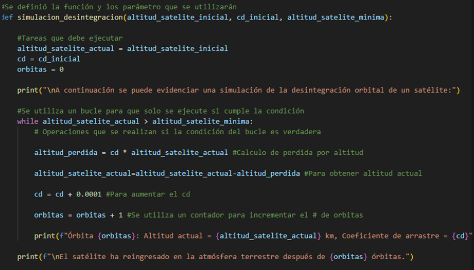

# Desintegración orbital de un satélite debido debido a la resistencia atmósferica

Se desarrolló un código con el fin de simular el descenso del satélite hasta que reingrese en la atmósfera terrestre

### Para la explicación de la parte 1 del código, se adjunta la siguiente imagen para mejor visualización:

### A continuación, se explicará lo que se realizó en la primera parte del código:
1. Se definió la función y los parámetros que se utilizarían en el código. La función definida fue simulación_desintegracon, y los parámetros altitud_satelite_inicial, cd_inicial, altitud_satelite_minima 

2. Luego, dentro de la función se definió las tareas que debe ejecutar como que la altitud_satelite_actual=altitud_satelite_inicial (esta con el fin de que al realizar los cálculos tome como valor inicial la altitud actual), con el cd=cd_inicial es para que asuma que el cd ingresado por el usuario es el cd a la altitud inicial, y se debe indicar que inicia en orbitas=0 para que empiece a incrementar desde ese valor.

3. Posteriormente, se crea un bucle para que se ejecute solo si la condición de que altitud_satelite_actual>altitud_satelite_minima si esta condición no se cumple, no se ejecuta el bucle.

4. Operaciones que realiza el bucle si la condición se cumple: calcula la perdida por altitud con altitud_perdida=cd*altitud_satelite_actual, luego calcula la altitud_satelite_actual = altitud_satelite_actual-altitud_perdida (acá se utiliza la perdida por altitud y este proceso se realiza hasta que el satélite reingrese a la atmosfera), cd=cd+0.0001 esto para aumentar el cd a medida que disminuye la altitud_satelite_actual y finalmente orbitas=orbitas+1 para ir incrementando el numero de orbitas y así poder decir al final del código después de cuantas orbitas reingresa el satélite en la atmosfera terrestre. 

